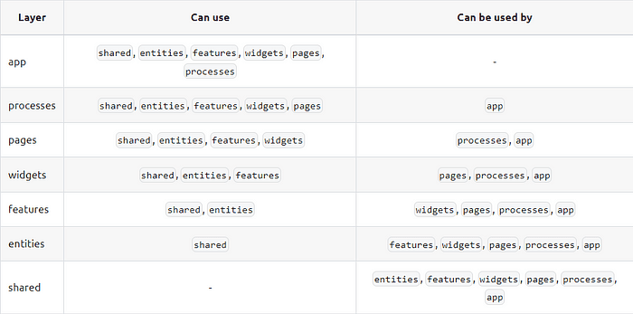

# FSD 2.1

← [Назад][back]

---

- `📂 app (слой/слайс)`
    - `📁 routes (сегмент)`
    - `📁 analytics (сегмент)`
- `📂 pages (слой)`
    - `📁 home (слайс)`
    - `📂 article-reader (слайс)`
        - `📁 ui (сегмент)`
        - `📁 api (сегмент)`
    - `📁 settings`
- `📂 shared (слой/слайс)`
    - `📁 ui (сегмент)`
    - `📁 api (сегмент)`

## Слои

1. **App** * — всё, благодаря чему приложение запускается — роутинг, точки входа, глобальные стили, провайдеры и т. д.
2. **~~Processes~~** (процессы, устаревший) — сложные межстраничные сценарии.
3. **Pages** (страницы) — полные страницы или большие части страницы при вложенном роутинге.
4. **Widgets** (виджеты) — большие самодостаточные куски функциональности или интерфейса, обычно реализующие целый
   пользовательский сценарий.
5. **Features** (фичи) —_повторно используемые_реализации целых фич продукта, то есть действий, приносящих
   бизнес-ценность пользователю.
6. **Entities** (сущности) — бизнес-сущности, с которыми работает проект, например`user`или`product`.
7. **Shared** * — переиспользуемый код, особенно когда она отделена от специфики проекта/бизнеса, хотя это не
   обязательно.

_* — эти слои, App и Shared, в отличие от других слоев, не имеют слайсов и состоят из сегментов напрямую._

> Фишка слоев в том, что модули на одном слое могут знать только о модулях со слоев строго ниже, и как следствие,
> импортировать только с них.

## Слайсы

Дальше идут слайсы, они делят слой по предметной области. Вы можете называть ваши слайсы как угодно, и создавать их
сколько угодно. Слайсы помогают не теряться в проекте, потому что группируют тесно связанный по смыслу код.

> Слайсы не могут использовать другие слайсы на том же слое, и это обеспечивает сильную связанность кода внутри слайса и
> слабую сцепленность между слайсами.

## Сегменты

Слайсы, а также слои App и Shared, состоят из сегментов, а сегменты группируют код по его назначению. Имена сегментов не
зафиксированы стандартом, но существует несколько общепринятых имен для наиболее распространенных целей:

- `ui`— всё, что связано с отображением: UI-компоненты, форматтеры дат, стили и т.д.
- `api`— взаимодействие с бэкендом: функции запросов, типы данных, мапперы.
- `model`— модель данных: схемы валидации, интерфейсы, хранилища и бизнес-логика.
- `lib`— библиотечный код, который нужен другим модулям этого слайса.
- `config`— файлы конфигурации и фиче-флаги.

## Концепция

Папки внутри`📂 app`,`📂 shared`и`📂 pages/article-reader`называются_сегментами_, и они делят слайсы по техническому
назначению, то есть по тому, для чего предназначен код.

- 📂`api/`
    - для взаимодействия с бэкендом
    - получить постраничный список статей с количеством лайков, оставить лайк
- 📂`ui/`
    - для кода, отвечающего за отображение и внешний вид
    - список вкладок, который может отображать дополнительную вкладку при выборе тэга
    - отдельная статья
    - рабочая пагинация
- 📂`model/`
    - для хранения данных и бизнес-логики
    - клиентское хранилище загруженных постов и текущей страницы (при необходимости)
- 📂`config/`для фиче-флагов, переменных окружения и других форм конфигурации

Мы поместим код, который получает тэги, в`api`, сам компонент тэга в`ui`, а взаимодействие с хранилищем в`model`.

### `📂 pages`

Папки внутри`📂 pages`называются_слайсами_. Они делят слой по домену (в данном случае, по страницам).

Страницы не могут зависеть друг от друга, то есть одна страница не может импортировать код с другой страницы. Это
связано с**правилом импорта для слоёв**:

1. `ui`будет содержать саму страницу и составляющие её блоки
2. `api`будет содержать более специализированные функции получения данных, использующие`shared/api`
3. `model`может содержать клиентское хранилище данных, которые мы будем отображать

> Модуль (файл) в слайсе может импортировать другие слайсы только в том случае, если они расположены на слоях строго
> ниже.

### `📂 shared`

- 📂`ui/`— UI-кит, только внешний вид, без бизнес-логики. Например, кнопки, диалоги, поля форм. Содержит наш
  переиспользуемый UI-кит.
- 📂`api/`— удобные обёртки вокруг запросов на бэкенд (например, обёртка над`fetch()`в случае веба). Содержит наши
  примитивы для взаимодействия с бэкендом.
- 📂`config/`— обработка переменных окружения
- 📂`i18n/`— конфигурация поддержки разных языков
- 📂`router/`— примитивы и константы маршрутизации

> Названия сегментов должны описывать**цель (почему), а не суть (что)**.

> Такие названия как`components`,`hooks`или`modals`_не стоит_использовать, потому что они описывают, что содержат эти
> файлы по сути, а не то, с какой целью писался этот код.

## Публичный API

_Публичный API_означает, что слайс или сегмент объявляет, что из него могут импортировать другие модули в проекте.
Например, в JavaScript это может быть файл`index.js`, который переэкспортирует объекты из других файлов в слайсе. Это
обеспечивает свободу рефакторинга внутри слайса до тех пор, пока контракт с внешним миром (т.е. публичный API) остается
неизменным.

📂 pages/
📂 feed/
📄 index
📂 sign-in/
📄 index
📂 article-read/
📄 index
📁 …
📂 shared/
📂 ui/
📄 index
📂 api/
📄 index
📁 …

## Слои

Каталоги верхнего уровня в «FSD» называются «слоями», и это первый уровень дробления приложения. У нас есть строго
определённое число возможных слоёв, некоторые из них опциональные. Слои стандартизируются, и в настоящее время
выделяется семь таких слоёв:

- **Разделяемый уровень.**Содержит различные ресурсы для повторного использования, не зависящие от функционирования
  бизнес-логики. Отличные примеры таких элементов – инструменты для работы с UI, вспомогательные функции, логгеры.
- **Уровень объектов.**Он содержит бизнес-объекты, специфичные для проекта. Например, User, Payments, Products и т.д.
- **Уровень фич.**Содержит пользовательские истории. Код, ценный с точки зрения бизнеса. Например, `ChangePassword`,
  `MakePayment`, `BuyProduct`.
- **Уровень виджетов.**Содержит компоненты, из которых составляются объекты и фичи. Например, `UserSettings`,
  `PaymentsList`, `ProductsList`.
- **Уровень страниц.**Содержит страницы приложения. Это композиционный уровень, собираемый из объектов, фич и виджетов.
- **Уровень процессов.**Содержит сложные внутристраничные сценарии, например, механизмы аутентификации и капчу.
- **Уровень приложения.**Содержит настройки приложения, стили и провайдеры. Например, `withAuth`.

За каждым из уровней закреплена своя зона и ответственности и, как видите, все они сильно ориентированы на бизнес. Кроме
того, у них ступенчатая иерархия, как показано на следующей картинке. Она строится так, чтобы получился понятный
однонаправленный поток данных, что значительно повышает удобство работы с приложением.

Чем ниже модуль расположен в этой иерархии, тем опаснее производить его рефакторинг. Например, если вы измените
компонент Modal на разделяемом уровне, это сильнейшим образом скажется на всём приложении.

---

← [Назад][back]

[back]: <.> "Назад к оглавлению"
